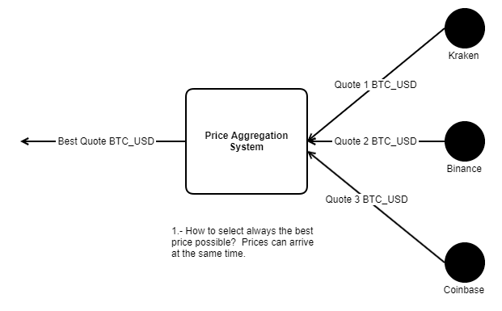

# IMPORTANT

1. Please, follow de instructions given in the presentation.
2. The difficulty of the exercise is incremental. 
3. It is not mandatory to pass all the test. 
4. The purpose of this test is to check your programing skills.
5. It is not allow talking with anyone during the exam.
6. Feel free to access to any resource on Internet.
7. Human interaction or AI  support is not allowed except with the interviewer

# Schema

# Exercise 1
Simulate the behavior of 3 different Quote providers (KRAKEN, BINANCE and COINBASE).

An instrument is a currency pair.For example BTC_USD
To simplify we will use only the instrument BTC_USD in this exercise.

A Quote is a market data which gives the bid and ask price of an instrument.
To simplify we consider a Quote as a simple aggregation of price, instrument, provider name and a timestamp.

A Provider is an institution which provides quotes for different instruments.

Every second, each Provider generates a new price and sends a Quote with the price to PriceAggregation. When this quote arrives to PriceAggregation should be printed in the following format:
> Received new quote [Provider : COINBASE , Instrument: BTC_USD, price: 9.88300994064184002, Time: 2022-07-27T09:57:03.152127Z]
> 
> Received new quote [Provider : BINANCE , Instrument: BTC_USD, price: 9.91454720868519657, Time: 2022-07-27T09:57:03.152104Z]
> 
> Received new quote [Provider : KRAKEN , Instrument: BTC_USD, price: 9.86205155510475373, Time: 2022-07-27T09:57:03.151963]

These values are examples given the use of random prices.

Hint :
- You can use a Simple Thread which sleeps every second until is finished (TimeUnit.sleep(1)).
- Don't forget to end all your Threads (Step 5).
- Use the Delta class to generate newRandomDelta to change the current price of each Provider.

# Exercise 2
Every 5 seconds PriceAggregation will print the best quote (The quote with the less price):
> The best quote for BTC is [Provider : COINBASE , Instrument: BTC_USD, price: 7.93370810991729572, Time: 2022-07-27T09:57:07.147347Z]

This value is an example given the randomness in prices.
